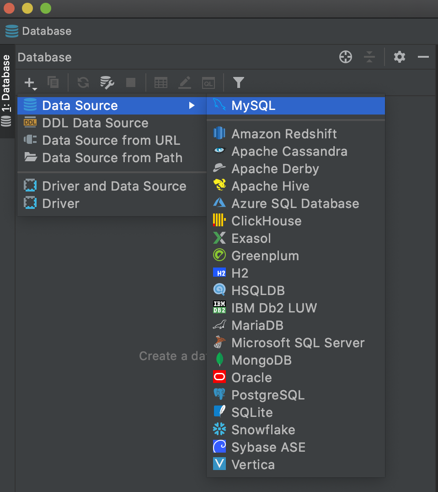
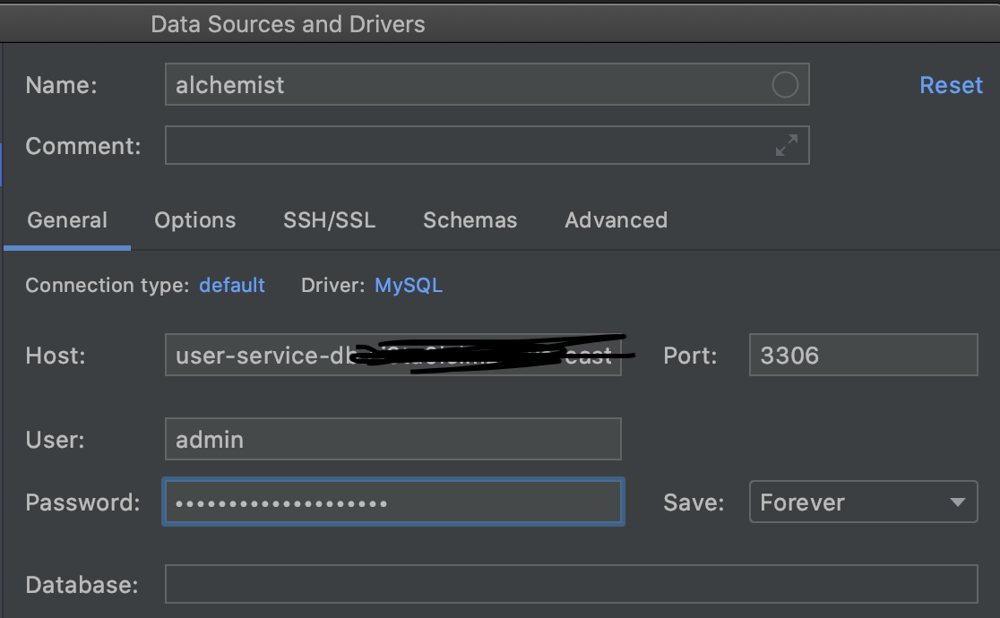
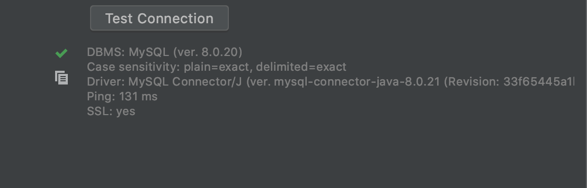

# Overview
Right now, we are using AWS RDB to store our senstive data for better maintainence and security

# Table Schema

We have two tables 
- user
- strategies

The create statement for the two tables are


```sql
-- user table
create table user
(
	id int auto_increment
		primary key,
	username varchar(32) not null,
	email varchar(32) null,
	image_file text null,
	password text not null
);
```

```sql
-- strategies table
create table strategies
(
	user_id int not null,
	strategy_location varchar(1024) not null,
	strategy_id int auto_increment
		primary key,
	last_modified_date datetime not null,
	last_modified_user varchar(32) null,
	strategy_name varchar(64) not null,
	constraint userid_fk
		foreign key (user_id) references user (id)
			on update cascade on delete cascade
);
```

# Setting up connection

Using database management applications are strongly encouraged. **DataGrips** from JetBrain is highly recommended

## Step 1: Download DataGrip
Download DataGrip from Google

## Step 2: Configure Credentials
You need to create credentials to access AWS RDB from local

```sh
# research_lab
touch .cred
```

Ask administrator to paste the credential to `.cred` file. Share with administrator your public IP to get access. Go to google and search "what is my IP" and you will get it.

Finally 
```sh
./start.sh
```

## Step 3. Use DataGrip to test your connection

press + in the datagrip, add data source and select my sql


change the configuration as per the .cred file


test connection, which is in the below, and it should be successful


## Quickly test the connection in terminal so that will run successfully in the flask server

```python
# under research_lab/ folder
❯ python
Python 3.8.5 (default, Sep  4 2020, 02:22:02) 
[Clang 10.0.0 ] :: Anaconda, Inc. on darwin
Type "help", "copyright", "credits" or "license" for more information.
>>> from utils import rds
>>> rds.get_connection()
<pymysql.connections.Connection object at 0x7f9888132d60>
>>> exit()
```
