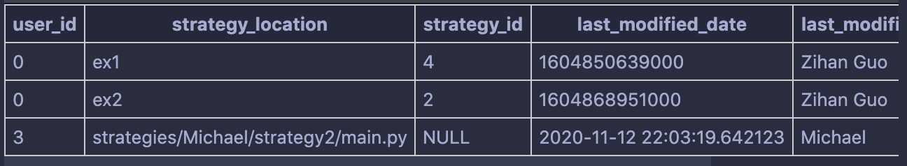

# Strategy upload 
User will upload strategies, and we will store the strategies under strategies/\<username> folder and run a pylint on the strategy. If it passes the pylint check, the folder will be saved and notify users, otherwise the folder will be deleted and users will be notified.

strategies will be store under strategy+ \<id> folder under a username folder. The strategy will also name "main.py"

# database storage
we stick to the schema in strategies table under alchemist.db
## location
the location is relative to the flask app, e.g. strategies/Michael/strategy7/main.py

for example, I log in as Michael and upload strategy

Take a look at the third row in the database, and the location and modifier will be there

## TODO
I suggest the database schema to have auto_increment of strategy_id, and link a foreign_ket from user_id to user.user_id

